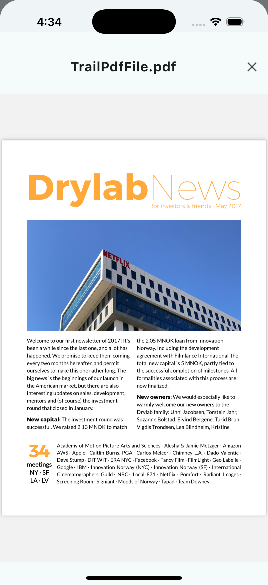
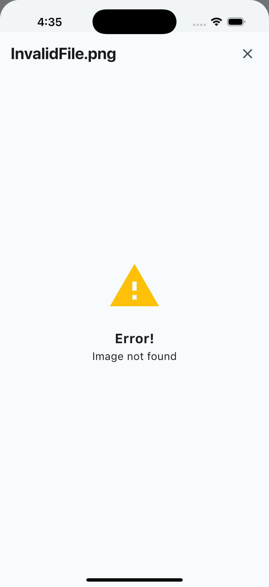

# RSPL Network File Viewer

[](https://pub.dev/packages/rspl_network_file_viewer) [](LICENSE) [](https://flutter.dev) [](https://dart.dev) [](https://github.com/rishabhsoftwarepvtltd/FlutterNetworkFileViewer) [](https://github.com/rishabhsoftwarepvtltd/FlutterNetworkFileViewer)

This is a customizable Flutter widget designed to display files like images and PDFs directly from a network source. It supports various customization options for appearance, headers, and error handling.

## Features
- Supports multiple file types, including images and PDFs.
- Customizable UI with background color, content padding, and optional custom header.
- Provides HTTP headers for secure or authenticated file access.
- Includes a fallback error widget for better user experience.


   



## Dependencies

This package leverages the following pub.dev packages to provide its core functionality:

| Package | Purpose |
|---------|---------|
| [easy_image_viewer](https://pub.dev/packages/easy_image_viewer) | Used for rendering images with interactive double-tap zoom and pinch-to-zoom gestures |
| [flutter_cached_pdfview](https://pub.dev/packages/flutter_cached_pdfview) | Used for displaying PDF documents with built-in caching for offline access and improved performance |

## Platform Support

- **Android** — API Level: 21
  - Android Version: Android 5.0
- **iOS** — iOS 13.0+

## Requirements

- **Dart**: >=3.4.0 <4.0.0
- **Flutter**: Flutter 3.24.0+ based on Dart 3.4.0
- **iOS**: >=13.0
- **Java**: 1.8 (Java 8)
- **Kotlin**: 1.8.22
- **Android Gradle Plugin**: 8.1.0
- **Gradle wrapper**: 8.3

## Permissions Required

- **Android**: INTERNET permission
- **iOS**: No explicit permissions

## Description

A customizable Flutter widget for displaying images and PDFs directly from network URLs with built-in caching, customizable headers, and error handling. Supports authenticated file access via custom HTTP headers and provides a flexible UI with optional custom header and error widgets.

## Highlights / Features

• 📄 **Multi-format support**: Display images (PNG, JPG, JPEG, GIF, BMP, TIFF) and PDF documents from network URLs

• 🎨 **Customizable UI**: Background colors, content padding, custom headers, and error widgets for branding and UX

• 🔐 **Authentication ready**: Custom HTTP headers support for secure file access with Bearer tokens, API keys, and custom authentication

• 💾 **Smart caching**: Built-in PDF caching for offline access and improved performance with automatic cache management

• 🔍 **Enhanced image viewing**: Double-tap zoom functionality for images with smooth pinch-to-zoom gestures

• 🛡️ **Error handling**: Default error widgets with theme-aware styling, plus support for custom error displays

• 🧪 **Well-tested**: Comprehensive unit tests covering all widgets and core functionality

• 🚀 **Easy integration**: Simple API with minimal setup—just provide file type, URL, and optional customization parameters

• 📱 **Platform optimized**: Works seamlessly on Android and iOS with proper theme integration and Material Design support

• 🎯 **Flexible**: Use default widgets or provide completely custom header and error widgets for full control over the viewing experience


## Getting Started

### 1) Install

Add the dependency to your `pubspec.yaml`:

```yaml
dependencies:
  rspl_network_file_viewer: ^1.0.0
```

Then run:

```bash
flutter pub get
```

### 2) Import

```dart
import 'package:rspl_network_file_viewer/rspl_network_file_viewer.dart';
```

## Usage

### Minimal

```dart
NetworkFileViewer(
  fileType: NetworkFileType.image,
  fileUrl: "https://example.com/image.jpg",
  fileName: "Sample Image",
).showViewer(context);
```

### Common example with authentication and customization

```dart
NetworkFileViewer(
  fileType: NetworkFileType.pdf,
  fileUrl: "https://api.example.com/documents/report.pdf",
  fileName: "Annual Report 2024",
  customHttpHeaders: {
    "Authorization": "Bearer $token",
    "Accept": "application/pdf",
  },
  backGroundColor: Colors.grey.shade100,
  contentPadding: const EdgeInsets.all(16.0),
  customHeaderWidget: CustomHeaderWidget(
    title: "Annual Report 2024",
    onClose: () => Navigator.of(context).pop(),
  ),
  errorWidget: Center(
    child: Column(
      mainAxisAlignment: MainAxisAlignment.center,
      children: [
        Icon(Icons.error_outline, size: 48, color: Colors.red),
        const SizedBox(height: 16),
        Text(
          "Failed to load document",
          style: Theme.of(context).textTheme.titleMedium,
        ),
      ],
    ),
  ),
).showViewer(context);
```

### Image with double-tap zoom

```dart
NetworkFileViewer(
  fileType: NetworkFileType.image,
  fileUrl: "https://example.com/photo.jpg",
  fileName: "Photo",
  backGroundColor: Colors.black,
  contentPadding: EdgeInsets.zero,
).showViewer(context);
```


## Configuration

| Property | Type | Default | Description |
|----------|------|---------|-------------|
| `fileType` | `NetworkFileType` | **required** | Type of file to display: `NetworkFileType.image` or `NetworkFileType.pdf` |
| `fileUrl` | `String` | **required** | Network URL of the file to load and display |
| `fileName` | `String?` | `null` | File name displayed in the header. Required if `customHeaderWidget` is `null` |
| `customHttpHeaders` | `Map<String, String>?` | `null` | Optional HTTP headers for authentication or custom requests (e.g., `{"Authorization": "Bearer token"}`) |
| `backGroundColor` | `Color?` | `Theme.colorScheme.surface` | Background color of the file viewer container |
| `contentPadding` | `EdgeInsetsGeometry?` | `EdgeInsets.zero` | Padding around the file viewer content |
| `customHeaderWidget` | `Widget?` | `DefaultHeaderWidget` | Custom widget to replace the default header. If `null`, uses `DefaultHeaderWidget` with `fileName` |
| `errorWidget` | `Widget?` | `DefaultErrorWidget` | Custom widget displayed when file loading fails. If `null`, uses `DefaultErrorWidget` |

**Note:** 
- `fileName` is required when `customHeaderWidget` is `null` (enforced by assertion)
- Images support double-tap zoom functionality automatically
- PDFs are cached automatically for offline access
- All default widgets use theme-aware colors from `ThemeData.colorScheme`

## Theming & Accessibility

• **Theme integration**: Uses `Theme.of(context).colorScheme` by default:
  - `colorScheme.surface` for the main viewer container background
  - `colorScheme.error` for error icons in `DefaultErrorWidget`
  - `colorScheme.onSurface` for text colors with proper alpha values
  - `textTheme.headlineSmall` for header titles with theme-aware typography

• **Theme-aware widgets**: Default widgets (`DefaultHeaderWidget`, `DefaultErrorWidget`) automatically adapt to your app's `ThemeData` and `ColorScheme` without additional configuration

• **Customizable colors**: Optional `backGroundColor` parameter allows overriding the default theme color while maintaining theme consistency for other elements

• **Contrast**: Text colors use theme-aware `onSurface` with alpha values, but no explicit contrast validation

## Performance

• **Automatic caching**: PDFs are cached using `flutter_cached_pdfview` for offline access and faster subsequent loads. Images use Flutter's built-in `Image.network` caching.

• **StatelessWidget architecture**: All widgets use `StatelessWidget` to avoid unnecessary rebuilds and minimize memory overhead.

• **No custom shaders or painters**: Uses standard Flutter widgets that work efficiently across web, mobile, and desktop platforms.

• **Asynchronous loading**: Files load asynchronously with progress indicators, preventing UI blocking during network requests.

• **Optimized modal presentation**: Uses `showModalBottomSheet` with `isScrollControlled` for efficient rendering and memory management.

• **For lists**: When displaying multiple file viewers in a list, wrap individual items in `RepaintBoundary` and avoid rebuilding the `NetworkFileViewer` instance unnecessarily.


## Folder Structure

```
rspl_network_file_viewer/
├─ lib/
│  ├─ rspl_network_file_viewer.dart          # Main package export file
│  └─ src/
│     ├─ enum/
│     │  └─ network_file_type.dart              # Enum for file types (image, PDF, etc.)
│     ├─ network_file_viewer.dart               # Main NetworkFileViewer widget implementation
│     └─ widgets/
│        ├─ default_error_widget.dart           # Default error display widget
│        └─ default_header_widget.dart       # Default header widget for file viewer
├─ example/
│  └─ lib/
│     ├─ example_page.dart                      # Example page demonstrating the package
│     └─ main.dart                                      # Example app entry point
├─ test/
│  └─ src/
│     ├─ network_file_viewer_test.dart       # Tests for main NetworkFileViewer widget
│     └─ widgets/
│        ├─ default_error_widget_test.dart   # Tests for error widget
│        └─ default_header_widget_test.dart  # Tests for header widget
├─ analysis_options.yaml                          # Dart/Flutter linting configuration
├─ CHANGELOG.md                                # Package version history
├─ LICENSE                                              # License file
├─ CODE_OF_CONDUCT.md                  # Code of conduct file
├─ CONTRIBUTING.md                            # Contributing file
├─ README.md                                        # Package documentation
└─ pubspec.yaml                                       # Package dependencies and metadata
```

## Example

For a complete example, see the [example] directory.

## Keywords and Tags

flutter dart network file-viewer pdf-viewer image-viewer document-viewer network-file cached-pdf image-zoom file-display http-headers authentication modal-viewer

## Contributing

Contributions welcome! Please read:

- [CONTRIBUTING.md](CONTRIBUTING.md) – setup, branch strategy, commit convention
- [CODE_OF_CONDUCT.md](CODE_OF_CONDUCT.md)

Run checks before push:
- `dart format .`
- `flutter analyze`
- `flutter test`

## User Privacy Notes

- This package does not collect any user information or share data with third-party services.

## Author, Maintainers & Acknowledgements

- Developed by **[Rishabh Software](https://www.rishabhsoft.com/)**.
- Thanks to the Flutter community for the amazing packages used in this project.

## License

This package is licensed under the **Rishabh Software Source Available License (Non-Commercial) V.1**.

- ✅ Free for personal projects, learning, academic purposes, and evaluation
- ✅ You may modify and fork for non-commercial use
- ❌ Commercial use requires a separate license

For licensing inquiries, refer to [LICENSE](LICENSE) for contact details.

## Made by Rishabh Software Team

[Github](https://github.com/rishabhsoftwarepvtltd) • [Website](https://www.rishabhsoft.com/services/mobile-app-development)

## Contact

Have questions, suggestions, or feedback? We'd love to hear from you!

📧 **Email**: [opensource@rishabhsoft.com](mailto:opensource@rishabhsoft.com)

🌐 **Contact Us**: https://www.rishabhsoft.com/contact-us